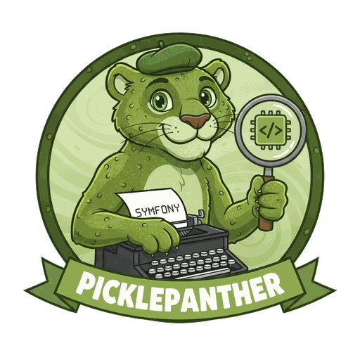
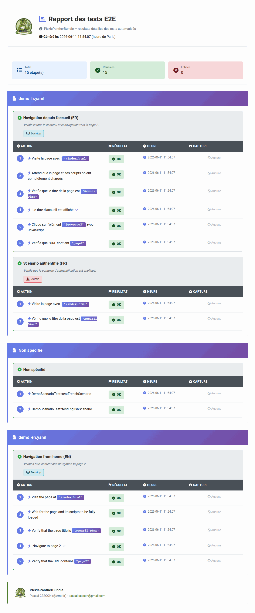

<p align="center">
  
</p>

<h1 align="center">PicklePantherBundle</h1>

A YAML-driven end-to-end testing engine for Symfony, built on top of
[Symfony Panther](https://github.com/symfony/panther).

Write browser scenarios in near-natural language (French **or** English), mapped
to PHP "sentences", and get a self-contained HTML report — without a line of
Behat/Gherkin glue.

```yaml
# tests/E2E/Scenario/homepage.yaml
scenarios:
  - nom: "La page d'accueil se charge"
    contexte:
      navigateur: desktop          # desktop | mobile
    etapes:
      - action: "Visite la page avec l'[/]"          # value written inline in the brackets
      - action: "Vérifie que le texte [text] est présent dans le sélecteur [selector]"
        args: { text: "Bienvenue", selector: "h1" }   # or listed explicitly under args
```

```php
final class HomepageTest extends BasePantherTest
{
    public function testHomepage(): void
    {
        $this->createScenarioRunner()->runTest(__DIR__.'/Scenario/homepage.yaml');
    }
}
```

## How it works

| Piece | Role |
|-------|------|
| **Scenario YAML** | Lists scenarios and their ordered steps (sentences + args). |
| **`#[Sentence]` providers** | Plain services whose methods are tagged with the sentence(s) they implement. |
| **`SentenceRegistry`** | Collects every provider and builds the sentence → method map. |
| **`ScenarioRunner`** | Parses a scenario file, applies its context, and runs each step. |
| **`BasePantherTest`** | The test case you extend; manages the browser and exposes `createScenarioRunner()`. |
| **`AuthenticatorInterface`** | Project-specific login, invoked when a scenario asks for an identity. |
| **`HtmlReporter` + `HtmlReportExtension`** | Accumulate step results and write `var/pickle-panther/report.html`. |

## Installation

```bash
composer require --dev amoifr/pickle-panther-bundle
```

Register the bundle for the `test` environment (`config/bundles.php`):

```php
return [
    // ...
    Amoifr\PicklePantherBundle\PicklePantherBundle::class => ['test' => true],
];
```

You also need a Chrome/Chromium browser and a **matching** `chromedriver`. The
easiest way is:

```bash
composer require --dev dbrekelmans/bdi
vendor/bin/bdi detect drivers     # downloads chromedriver into ./drivers
```

### PHPUnit configuration

Register Panther's web server and the report extension in `phpunit.xml.dist`:

```xml
<extensions>
    <bootstrap class="Symfony\Component\Panther\ServerExtension"/>
    <bootstrap class="Amoifr\PicklePantherBundle\Report\HtmlReportExtension">
        <parameter name="output_dir" value="var/pickle-panther"/>
    </bootstrap>
</extensions>

<php>
    <env name="PANTHER_WEB_SERVER_DIR" value="./public"/>
    <env name="PICKLE_PANTHER_OUTPUT_DIR" value="./var/pickle-panther"/>
    <!-- Recommended in CI/Docker: -->
    <env name="PANTHER_NO_SANDBOX" value="1"/>
</php>
```

> `output_dir` (extension parameter / `PICKLE_PANTHER_OUTPUT_DIR`) should match
> `pickle_panther.report.output_dir` so screenshots and the report land together.

## Configuration

All keys are optional; defaults are shown.

```yaml
# config/packages/pickle_panther.yaml  (test environment)
pickle_panther:
    locale: fr                         # default DSL language (fr|en) — matching is bilingual anyway
    scenarios_dir: '%kernel.project_dir%/tests/E2E/Scenario'
    report:
        enabled: true
        output_dir: '%kernel.project_dir%/var/pickle-panther'
    browser:
        headless: true
        chrome_args: []                # extra Chrome args appended to the defaults
        desktop: { width: 1920, height: 1080, user_agent: '...' }
        mobile:  { width: 375,  height: 812, pixel_ratio: 3, user_agent: '...' }

    # Optional: enable the built-in form-login authenticator (see below).
    auth:
        login_path: /login
        logout_path: /logout
        form_selector: 'form'
        email_field: '_username'
        password_field: '_password'
        roles:
            admin: { email: '%env(E2E_ADMIN_EMAIL)%', password: '%env(E2E_ADMIN_PASSWORD)%' }
            user:  { email: '%env(E2E_USER_EMAIL)%',  password: '%env(E2E_USER_PASSWORD)%' }
```

Keep credentials out of the repository — read them from environment variables.

## Writing scenarios

A scenario file holds a `scenarios` list. Keys are bilingual:

| French | English |
|--------|---------|
| `nom` | `name` |
| `description` | `description` |
| `contexte` | `context` |
| `navigateur` (`desktop`/`mobile`) | `browser` |
| `identifié` | `identified` |
| `etapes` | `steps` |
| `action` | `action` |
| `titre` | `title` |
| `args` | `args` |

### Two ways to pass arguments

**1. Placeholder + `args` (explicit).** The action reuses the registered
sentence verbatim and values are listed under `args`:

```yaml
- action: "Click the element [selector] with JavaScript"
  args: { selector: "#go-page2" }
```

`args` are matched to the method parameters **by name** when the keys match the
parameter names (the natural case, since placeholders mirror parameter names);
otherwise they are passed **positionally** in declaration order.

**2. Inline values (concise).** Write the value directly inside the brackets and
drop `args` — values are bound to the method parameters **positionally, in
placeholder order**:

```yaml
- action: "Click the element [#go-page2] with JavaScript"
```

The exact-placeholder form always wins the lookup, so the two styles coexist
freely. Limitation: an inline value must not contain a closing bracket `]`
(e.g. CSS attribute selectors like `[data-x="y"]`) — use the explicit `args:`
form for those.

### Bundled sentences

`CommonSentences` (navigation, clicking, typing, waiting, assertions) and
`AdminSentences` (generic back-office menus/datagrids) ship enabled. Browse them
for the exact sentence strings — each method is annotated with its FR and EN
`#[Sentence]`.

### Adding your own sentences

Create a provider; autoconfiguration registers it automatically:

```php
use Amoifr\PicklePantherBundle\Attribute\Sentence;
use Amoifr\PicklePantherBundle\Sentence\AbstractSentenceProvider;

final class CheckoutSentences extends AbstractSentenceProvider
{
    #[Sentence('Ajoute le produit [sku] au panier', 'fr')]
    #[Sentence('Add product [sku] to the cart', 'en')]
    public function addToCart(string $sku): void
    {
        $this->client()->clickLink(/* ... */);
        $this->testCase()->assertSelectorExists('.cart-item');
    }
}
```

`$this->client()` is the current Panther client; `$this->testCase()` exposes the
PHPUnit assertions.

## Authentication

Authentication is project-specific, so it is pluggable.

- **Form login out of the box:** set `pickle_panther.auth` (above). The bundle
  wires a `FormLoginAuthenticator` and aliases it to `AuthenticatorInterface`.
- **Custom flow:** implement `AuthenticatorInterface` (or extend
  `FormLoginAuthenticator`) and alias your service:

  ```yaml
  services:
      App\Tests\E2E\MyAuthenticator: ~
      Amoifr\PicklePantherBundle\Auth\AuthenticatorInterface:
          alias: App\Tests\E2E\MyAuthenticator
  ```

A scenario then requests a logged-in context:

```yaml
- nom: "Espace admin"
  contexte:
    identifié: admin        # passed to AuthenticatorInterface::authenticate('admin', $client)
  etapes:
    - action: "Visite la page avec l'[url]"
      args: { url: /admin }
```

## The HTML report

After the suite finishes, `HtmlReportExtension` writes
`<output_dir>/report.html`: scenarios grouped by file, every step with its
status, timing, context badges (browser / identity) and screenshots. Run with
`E2E_DEBUG=1` to also capture a screenshot on **every** step (not just failures).

<p align="center">
  
</p>

## Requirements

- PHP `>= 8.2`
- Symfony `^7.1 || ^8.0`
- Chrome/Chromium + a matching `chromedriver`

## Author

**Pascal CESCON** ([@Amoifr](https://github.com/Amoifr)) ·
[pascal.cescon@gmail.com](mailto:pascal.cescon@gmail.com)
